# Build Journal

--------------------------

### Total Build Hours: 56 Hours

 

## Day 1

- **Date:** 1/4/2026
- **Total hours spent:** 5 Hours

My school wants me to finish this project in just a week :C, it will be a so exhausting week, but that's fine I can do it.

Well, I was looking for a recycled wood. I kept searching until I found this super cool place on my school's backyard. 

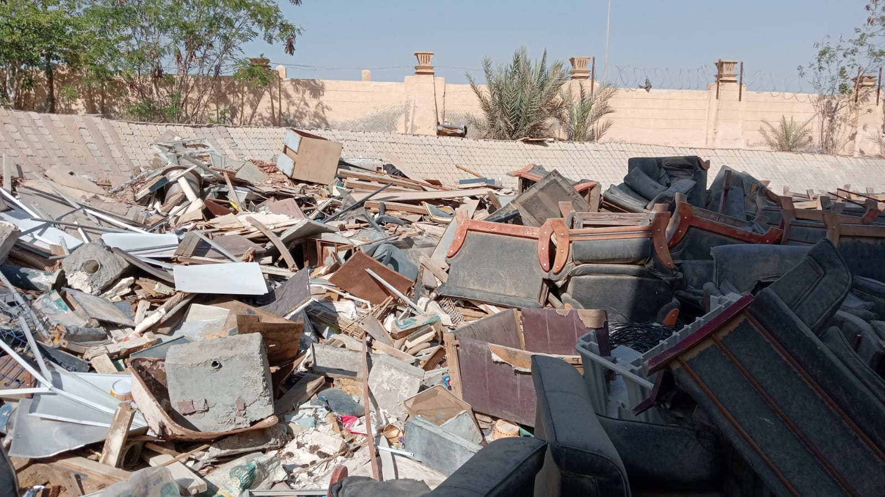

So, I took this old desk and took the top layer from it so I can use it as the base.

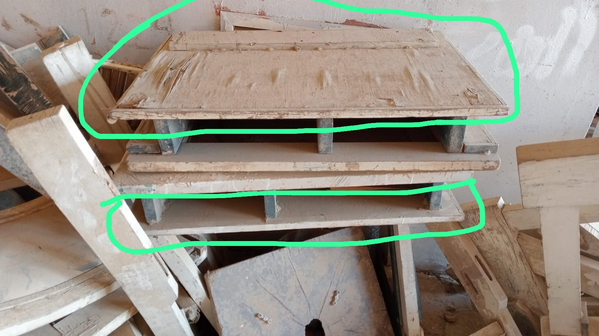

I also found some materials in my home like the PVC pipe and thin wood that I can make the sealing and the supporters with it. 

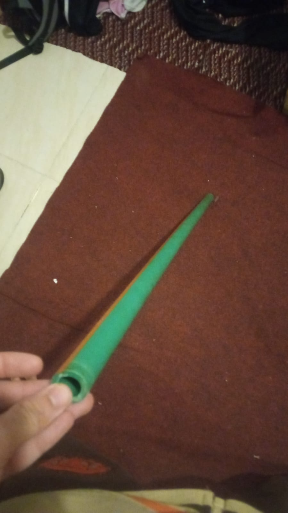
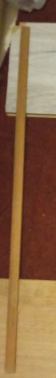

*(The searching process didn't count on the total Hours.)*

Well, after that I started by building the outer structure. Well, I was searching for the Wood columns that I will use. But the supporter wood I found in my home can't be used as columns as it is kinda thin. 

So, I found old drawers that can be used as columns after breaking them down. 

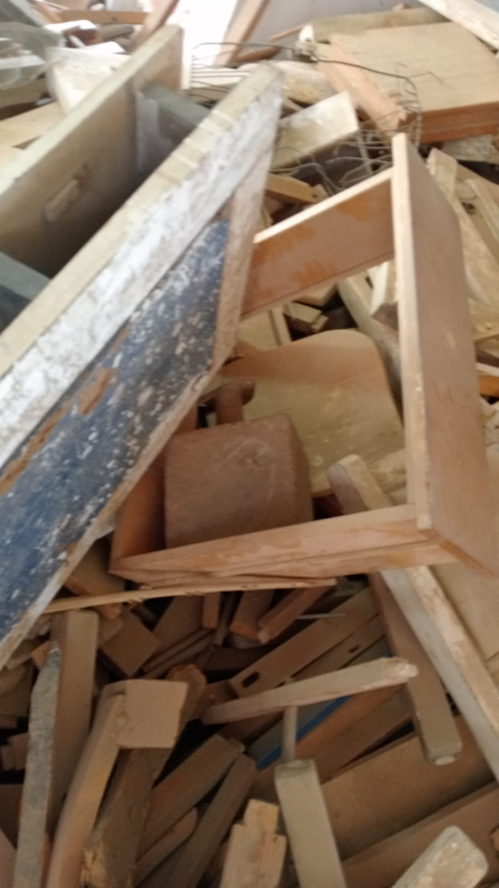
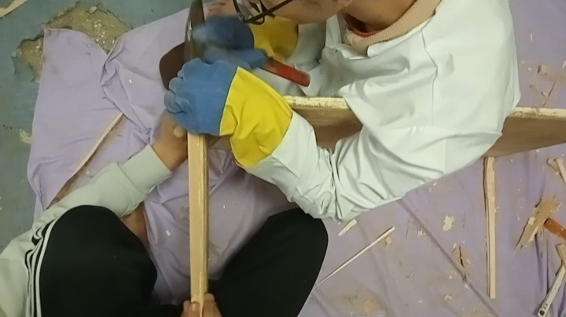

Then I put nails from the bottom of the base to each column so they can stick to the base and also used MDF glue to make it more solid. 

After that, of course the four wooden columns won't be that super solid so I used the supporter wood pieces I made so I can connect the four columns with each other and after that they were so much solid. 

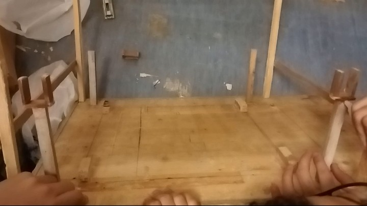

 

## Day 2

- **Date:** 2/4/2026
- **Total hours spent:** 7 Hours

I was very exhausted yesterday because I went to school without the bus with all the materials and ALSOOo worked on the project as I said above :c.

But now I slept well and can work a lil longer. So, let's go.

First, I started by setting up the soil for the plants and used an old full drawer for that. To prepare the planting base, I mixed the soil with peat moss and sand.

* **Video Link:** [Making the Peat Moss Soil](https://youtu.be/yI6NNnzTHSI)

And we placed an internal plastic bag so it can protect the drawer's wood from getting rotten. Once the protective layer was secure, I poured the freshly prepared mixture in.

* **Video Link:** [Pouring the Peat Moss Soil](https://youtube.com/shorts/tnRFBcnSGDY?feature=share)
* **Image Reference:** 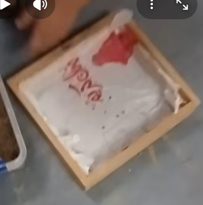

And yeah before putting the drawer into the structure, I also made another four columns for the motors and the light mechanism with its motor and PVC pipe holders. And with the same technique I used nails to reinforce them. 

After putting the soil inside the drawer, I placed the drawer inside the outer structure with some small wood pieces that will lift it a lil from the base so we can collect the water in a small plate.

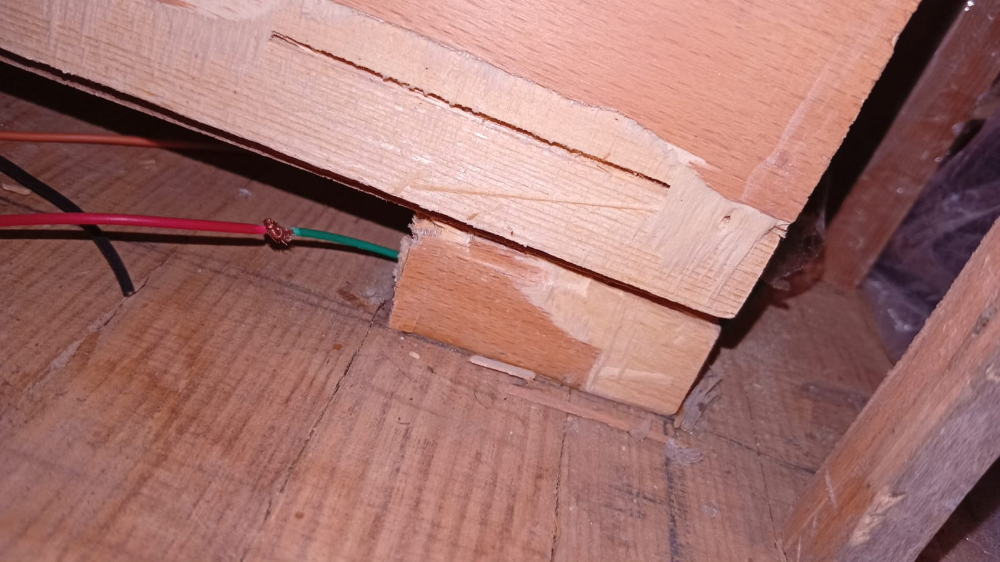

After putting the soil drawer inside the structure, I started building the cooling system wooden structure and fans places. Well, this one needed to be built separately first and then install it into the main structure after it is considered ready. 

So, I just took a wooden thin plate and then cut it with the dimensions in the 3D, after that I got two small columns and put them on top of the wooden plate. And used nails to stick them together. 

After that I put the fans on top each side and marked the nails places, and marked also the square where the cooling Peltier will be placed. Then I cut it and placed the Peltier and added on the hot side some thermal paste and then added the PC cooling fan that came with the heat sink. On the cold side I added the heat sink with the thermal paste and then added the PC normal fan and used the screws to reinforce everything.  

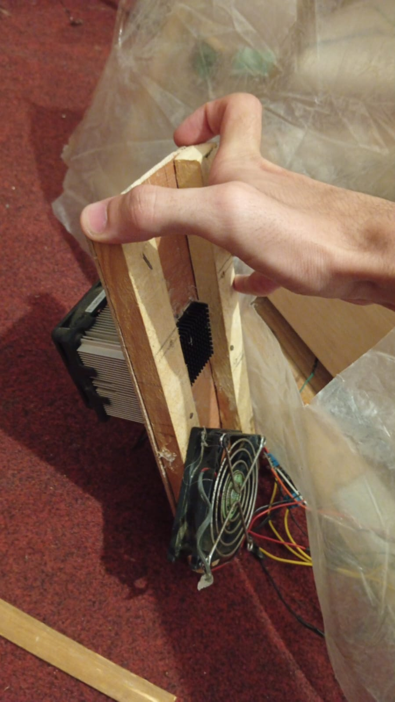

After that, it's time to install this part onto the main structure. Well, as usual I used the regular technique and used nails and MDF glue to reinforce it into the main structure and yeah connected it to the supporter wood. 

After finishing that part, I worked on the sealing structure and focused on making it as like as the shape we need and I made in the 3D. 

So, I started with making two rectangles with the dimensions. But I remembered that I need to reinforce that all when I finish many other things like the arcs of the light mechanism and so on. 

So, I stopped working for today and will continue in the next session. 

 

## Day 3

- **Date:** 3/4/2026
- **Total hours spent:** 6.5 Hours

I can see progress yay!

After that hard time in the last session, I killed myself on the bed for exactly 4 hours and then let's WORK again. I must finish this on time. 

Well, when I remembered that I need to delay the reinforcing of the sealing, I remembered that because I thought how I will install the arc and the light mechanism.

So, here we are building this. Well, this one was so funny. At first we were trying to just cut the supporter wood as regular small rectangles and place them on top of each other with the specified angles to make it as an arc. 

We decided to make it look prettier. We cut the wooden small rectangles while they are on top of each other so we can cut them with the same angles and shape the arc as a smooth arch, not wooden pieces placed on top of each other.  

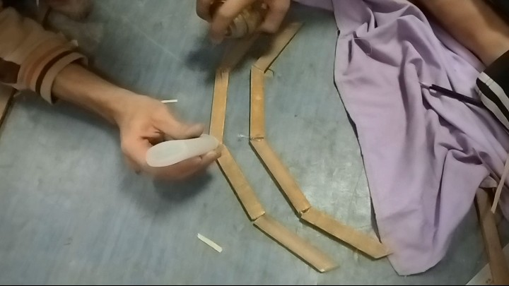

Well, now we need to talk about the arcs' columns which will have the arcs and the transparent bags mechanism above it. 

Ahh, this one was kinda weird. First I got the wooden columns as usual from destroying the old drawers. But when we look at the technique I was using to reinforce the columns with the nails... well, I can't do this here. This technique needs me to grab the column with my hand and put it in the required place and then using the nails and a hammer, I can drive the nail into the base from the other side through the base and to the column. But here, well the other side is too far. I can't use regular sized nails and also the tall nails can break the wood. 

So, I got a very cool idea. Well first I grabbed the columns, and using the hammer I drove the nail into the down side of the column separately without the soil drawer. I drove the nail a lil bit which can make a hole that the nail can be placed into. 

After that, I extracted the nail, and then cut its head, and then I re-drove the head side of the nail into the hole I made. After that, I grabbed the column to its place on the drawer, and finally I drove the whole column using the hammer as it works as the nail's head. 

Repeated that with the remaining 3 columns and yeah... I got these columns solid and well placed with that cool idea. I loved it so much tbh it was so funny.

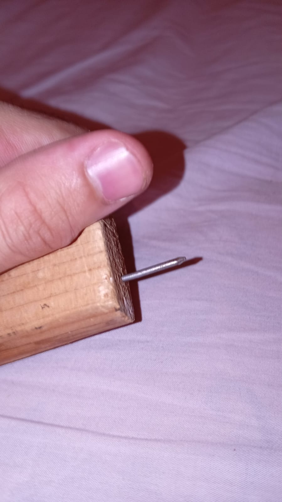

After this great step, I got the servo motors and connected the PVC pipes using MDF glue and very small nails into the +-shaped-gear of the servo. But at first I used the servo screw to connect the gear into the servo itself, because the screw can only be driven from the inside of the PVC pipe and it is very tall for any of my screwdrivers. 

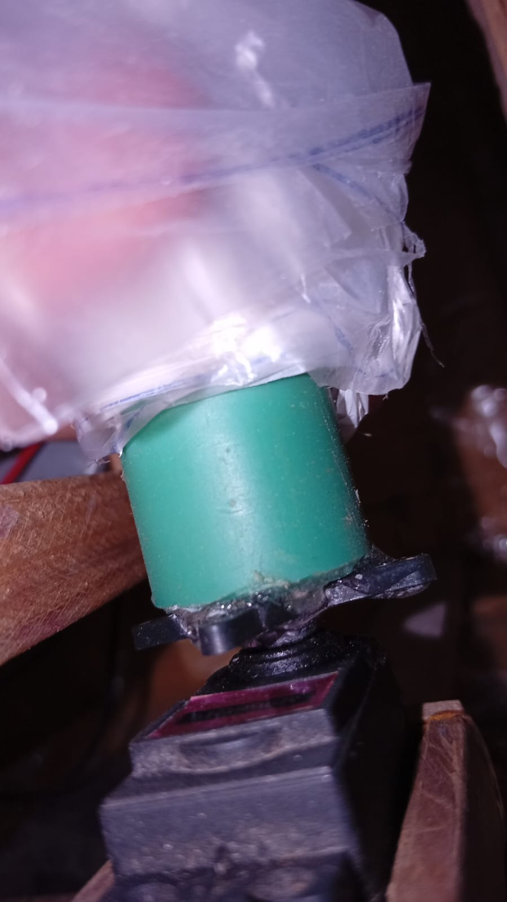

After that, I decided to make the very tall sheet of different transparent layers that will control the light intensity of the sun. Well, we took the measurement of the pipe's length and with a marker I drew the same length many times in parallel along each layer of bags so I can cut them and finally connect them with each other to make a chain of bags. Each end should be connected to the PVC pipe on each servo. 

* **Video Link:** [Testing the Light Transparent Bags Mechanism](https://www.youtube.com/shorts/U7GsUwmneE8?feature=share)

But I was very tired. So, let's call it a day and sleep the same 4-6 hours and continue work tomorrow.

 

## Day 4

- **Date:** 4/4/2026
- **Total hours spent:** 8 Hours

YAY, a lot of things are finished and yeah I need this time to focus on making the circuit and testing it up. 

My head hurts a lil and I didn't sleep well but I must finish this :|

Ok, started by testing up the circuit. Well, the most hard part was the screen. It was so exhausting as it has many pins and any small fault will make me search a lot about where it is. So, I made it very carefully and used small wires so it doesn't appear so overwhelming compared to the regular jumpers. 

Also, yeah I used a regular breadboard because the PCB will take time and I don't have it. It is 4 days till my exhibition and it must be fully functionable and tested. So, I used two breadboards and removed one power line from one of them and connected both of them with each other so they can perfectly size the weird ESP32-S3 width and the TFT touch screen width. 

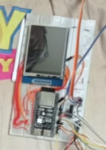

After that I wired all the pins with the ESP32-S3 and found that the display doesn't want to turn on. So, I searched a lot why even the backlight doesn't want to turn on even if the backlight uses 3V3 and doesn't need 5V0. Didn't find good info on the internet tbh so I just grabbed the display myself and traced it with my eyes. And yeah I found the very stupid problem. 

Yeah the display is using a voltage regulator. And this voltage regulator must take the 5V0 and convert it into 3V3, and it can't just take 3V3 and give 3V3. So, I kept searching if I can find any jumper pads on the TFT board but I didn't find. It seems that my TFT model doesn't come with these pads. So, for now I just used an external 5V0 from the Arduino and also connected all the GNDs and just tried the TFT with the ESP32-S3 to make sure it works... and it worked! 

When I connect everything in the control panel in the prototype I can just take 5V0 from the Power Supply Unit and give it to the TFT screen and just take 3V3 from the same unit to the other components. I am using a PC power supply, so this helps so much in getting different voltages without the need of step-ups or step-downs. 

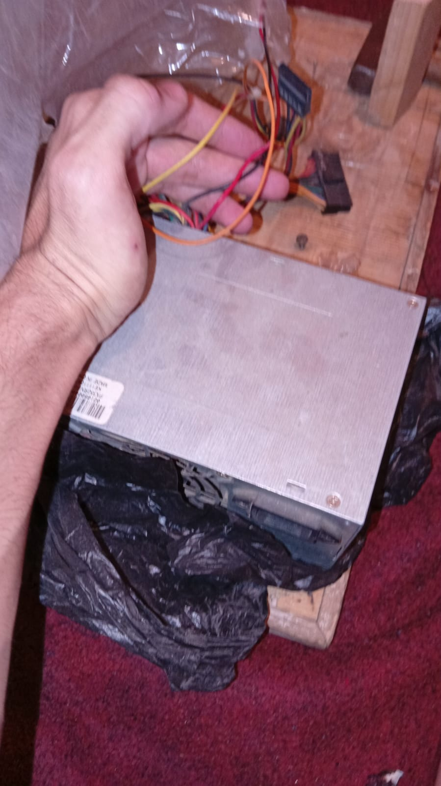

After that I used all the remaining pins to connect the actuators and the sensors. The sensors regularly took 3.3V from the ESP32 directly. But for the actuators they were using MOSFETs so the fans and the Peltier took 12V from the PSU and the MOSFET itself gave a PWM which is connected to the ESP32 PWM pins to control the actuators. And for the water pump it is all the same except I connected it with 5V not 12V.

Tested the circuit and all the components, it was kinda weird. But after some debugging it worked. 

After that I started working on the control panel structure. Well, this one's dimensions specifically needed to be changed. Because I am using a breadboard this time which is smaller than the PCB I made. So I took the measurements of the breadboard and made a frame around it using the same drawer I destroyed and also used the same technique I used when I made the cooling system. And made two holes for the wires from the bottom side. And made another thin wooden sheet to be like the cover of the control panel, and I made a rectangle hole for the screen.

After making that wooden control panel, I made two more lil columns and placed them on the front side aligned to the other main columns. And these columns were at the same height as the supporter wood. After driving these two columns and also making two angled supporters (to make the control panel angled to the user), I placed the control panel on them (they were in the middle) and then using nails I placed its top frame stick on the columns and then I pushed the control panel a lil downwards till it touches the two angled supporters. And then using MDF to just make it stick to the two supporters and then using two very thin nails I made it very solid and well angled.

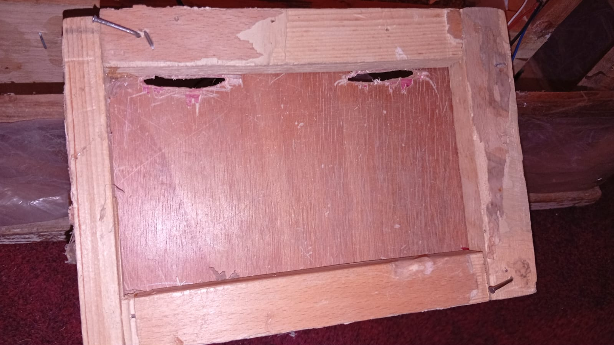

 

## Day 5

- **Date:** 5/4/2026
- **Hours:** 7 Hours

The project is likely at 80% progress.

Well, this time tbh I slept well so I am ready to insert all the circuit into the project.

Well, after installing the control panel on the structure, I started installing all the sensors and the actuators.

Well, I placed the breadboard that has the ESP32 and the TFT screen wired on it into the control panel structure. It fit perfectly and it was so cool and well angled. Well, the wood is not that perfect but at least I am the one who made it from scratch. 

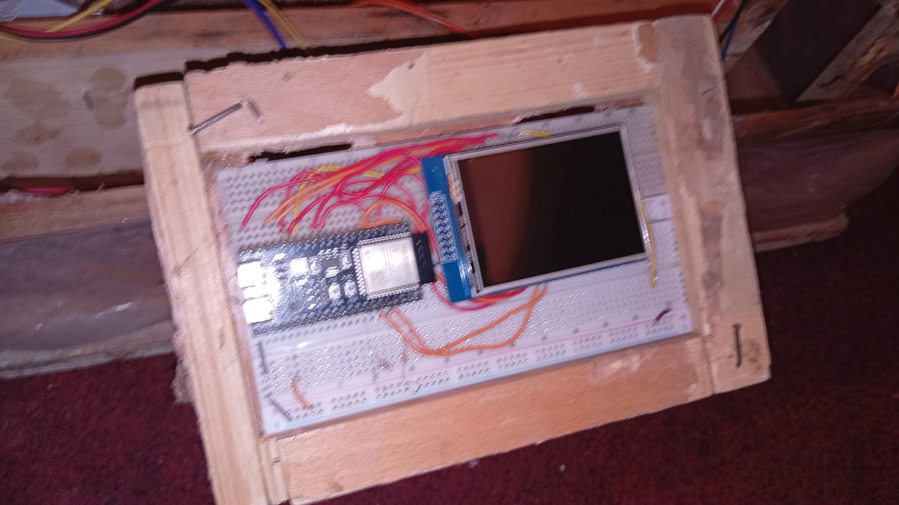

After that, I placed all the sensors in their places. Placing the sensors on their places was not the problem. The wiring was the problem. It was so overwhelming because the wires had to be so long to reach the control panel. And accidentally I got short wires so I needed to connect them with each other to make one big wire and connect each sensor with 4 or 3 of these long wires. So it was kinda hard to make that all but yeah I made it. 

Well, for the actuators it was kinda different where I just needed a maximum of 2 wires for the control, and for the power also 2, but these are directly coming from the PSU. 

So I wired the fans and the Peltier and the water pump easier than the sensors. And yeah of course all of the wires are routed from the bottom of the control panel (the two holes I made). To verify the fluid integration, I mounted the automated watering system for a quick diagnostic check.

* **Video Link:** [Installing the Irrigation System for Testing](https://youtu.be/krxk9sDdObg)
* **Image Reference:** 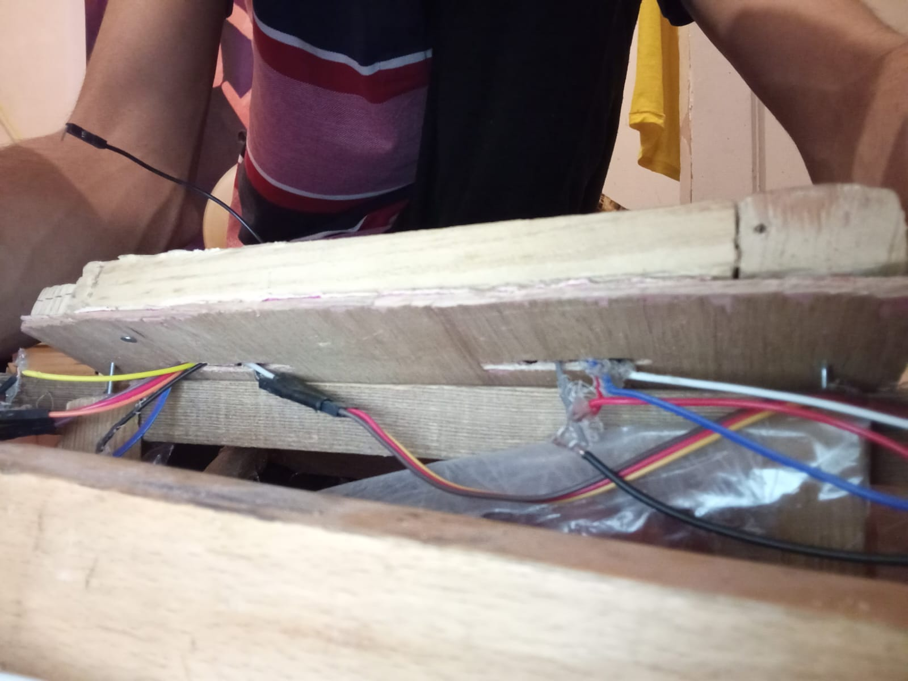

 

## Day 6

- **Date:** 6/4/2026
- **Hours:** 8 Hours

Remains one thing from the circuit and the sealing and the transparent covering.

Well I must finish that all today because I need to test it twice tomorrow and after.

Ahh, the thing that took me so much time and effort to make is the NeoPixel sticks chain. This thing was a nightmare in the circuit phase. 

The NeoPixel sticks were with no connectors, no pins, no easy connection thing. You take wires and solder them on very small pads and they are very close to each other. So I must solder well without them touching each other and without a flux because I forgot to buy flux.

So I got 6 equal-in-length wires and connected each one to a pad from the three usable pads on each end of the NeoPixel stick. There were four but there are two GNDs so it only will use three on each end (GND, VCC, Din/Dout).

I made this on all the 6 neo sticks and then connected each end of a neo stick to an end of another neo stick (the Din ends with the Dout pin).

After making this huge chain I placed each neo stick in its place inside the internal drawer, and then connected the last Din in the chain to an ESP32 pin and also connected the GND and the VCC.

Should I be super happy now? Of course not, the chain soldering sometimes cracks and disconnects. So I used a glue gun on all the ends of each neo stick so it can hold connection without a lot of moving. I tried it again and yeah it worked.

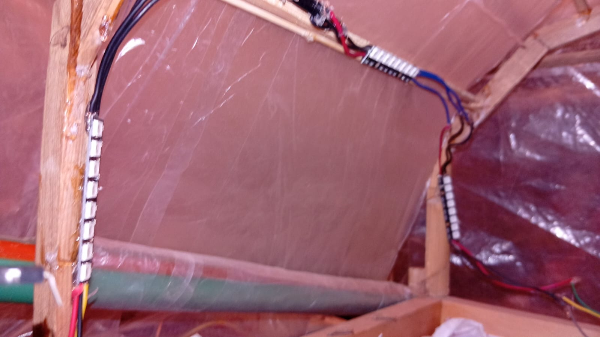

Should I be happy now? Of course noooot. I must finish it all today. So quickly I headed up to the next thing which is the sealing.

Well, we thought of making four windows on the top of the project because of thermal adaptation. So I decided to make it after I covered the project and started working on the sealing structure. I got the two rectangles I made and then put them on the top of the project and then with nails, I drove each corner into the columns so it can be solid. And of course there was another supporter wood stick under the triangles made because of the two rectangles from the front and the back. These supporters had a single very small supporter in the middle which held the triangle to be solid.

After that, I started by covering the whole project with transparent bags or sheets. I cut like rectangles for each side of the project and using a hot glue gun I placed all the rectangles in their places on all sides of the project (front, back, right, left, the two sealing rectangles and the triangles of the sealing). 

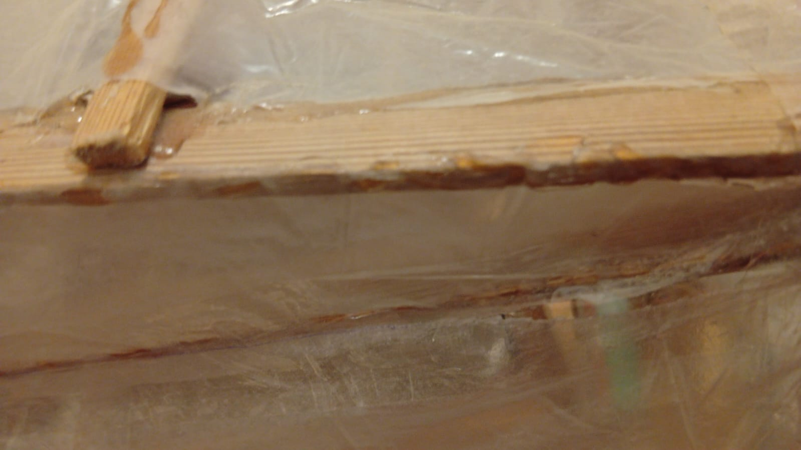

After covering the project and leaving the front side not fully glued so it can work as a door, I went to check the windows we wanted to make. 

Well, these windows were easy to make. First I cut many small sticks (like 24 sticks) to make four frames and four movable windows. And after using nails and MDF to make the frames, I placed them under the cover. 

I placed the windows inside the frame and glued it to the cover and then cut three outer sides between the frames and the windows and left the back side so it can act like a hinge. And with four other small sticks I made for each window a hang stick that keeps it open. 

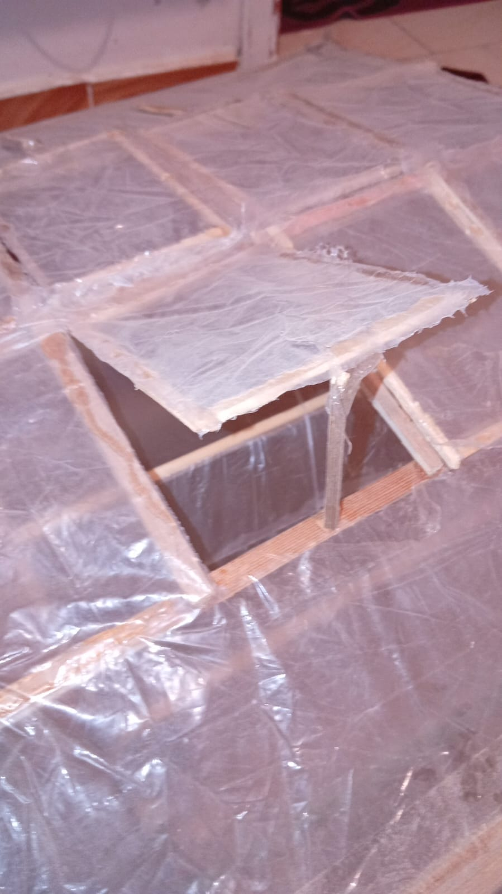

And yeah after all of that the project is 99% finished.

I connected all the GNDs to the PSU and also the VCC with different voltages and placed the PSU in its place and uploaded the code and made a quick check. And it all worked.

It is only remaining to make test plans tomorrow and after so we can take the best of them. We needed to capture the test plan as a time-lapsed vid so the evaluators could see it.

 

## Day 7

- **Date:** 7/4/2026
- **Hours:** 8 Hours

The testing day yayy.

Well, today I must fill our first 6-hour continuous test plan video. I need to confirm that the project is ready before this test.

So, I started checking the sensor readings and ran explicit calibration procedures for our diagnostic instruments to align inputs.

* **Video Link:** [Temperature Sensor Calibration (Run 1)](https://youtu.be/F82SWT_qha8)
* **Video Link:** [Temperature Sensor Calibration (Run 2)](https://youtube.com/shorts/RjeuQOubw8c?feature=share)
* **Video Link:** [Soil Moisture Sensor Calibration](https://youtube.com/shorts/Io8sj2iQW1w?feature=share)
* **Video Link:** [Light Sensor Calibration](https://youtube.com/shorts/46i1Kvqeklg?feature=share)
* **Video Link:** [Final Master Calibration Sequence](https://youtube.com/shorts/rd6x4uLS6xY?feature=share)

I noticed that the soil sensor got missed in the main file, so I recalibrated it and fixed it in the code. Then I checked the actuators. I reduced the sensor readings' ranges so the actuators can work and see them functioning.

Well, the light mechanism got stuck at the last level after checking. And I found that it was because I wrote 5 instead of 4 levels of bags, so I just edited it and it should work now.

Well, I started the 6 hours recording quickly because we didn't want to miss the hours range we are focusing to record at in the day. So, we just started and waited. 

As predicted, it is the first test so it is normal to find some failures. Well, the water pump didn't work when it should have. So, I just checked it and found that the wiring is all good, but I noticed that the GND was not connected so I just connected it and it worked. 

After this I waited again and also found another failure: the cooling fan didn't work. So, I checked the wiring and it was all good but I saw that the MOSFET wasn't getting any PWM signal. I checked the code and found that I forgot to add a HIGH value to the code after I deleted its code block and rewrote it to change the condition ranges. 

So I just paused, edited it, reflashed the code, resumed the recording, and waited to see any other problems. But I didn't find any and it worked well till the end. 

So, I need to record this again tomorrow with the same fixes and it should fully work for all the 6 hours.

 

## Day 8

- **Date:** 8/4/2026
- **Hours:** 6.5 Hours

I just woke up and checked the project if anyone had changed anything. But I found it all good so I just started the recording directly and waited. 

All 6 hours passed without any problems and it worked perfectly! So I will attach the time-lapsed vid and horrayyyyyyy I finished this all and I am only waiting for the evaluation day.

* **Video Link:** [The final vid we showed to the evaluator](https://youtu.be/LXKNpItwzMk)

* **Video Link:** [6-Hour Well-made Test Run (Time-Lapsed)](https://youtu.be/uwLwe9z7YVE)
* **Image Reference:** 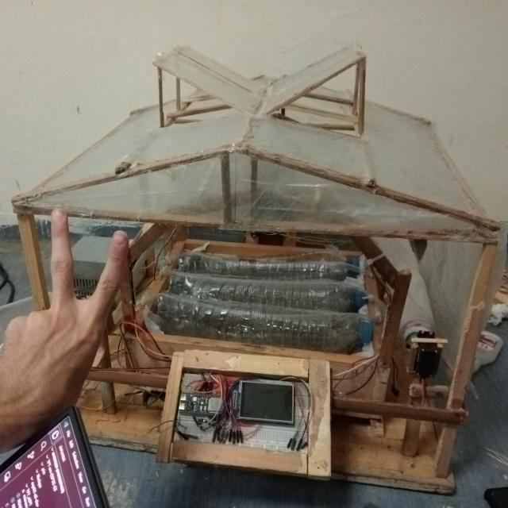
