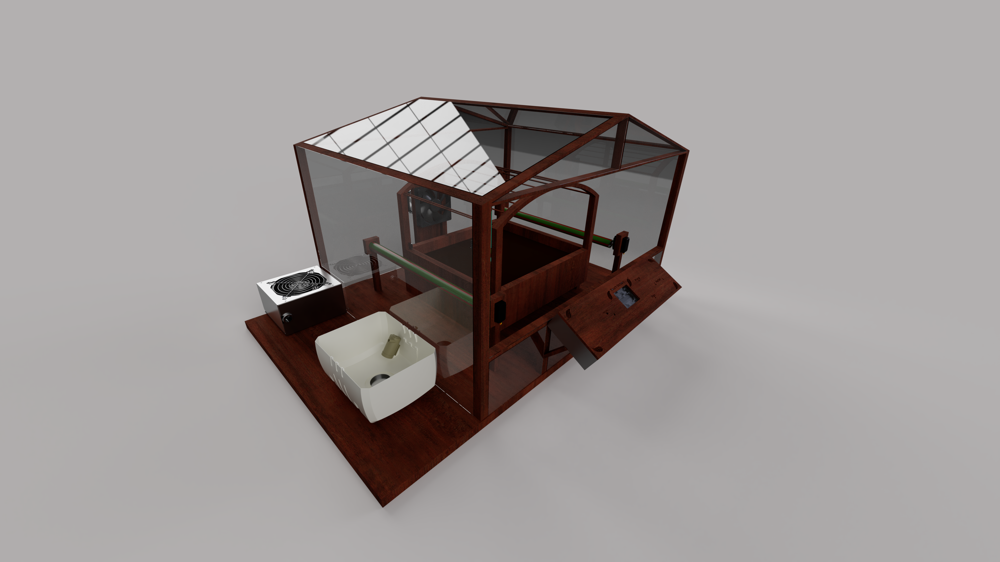
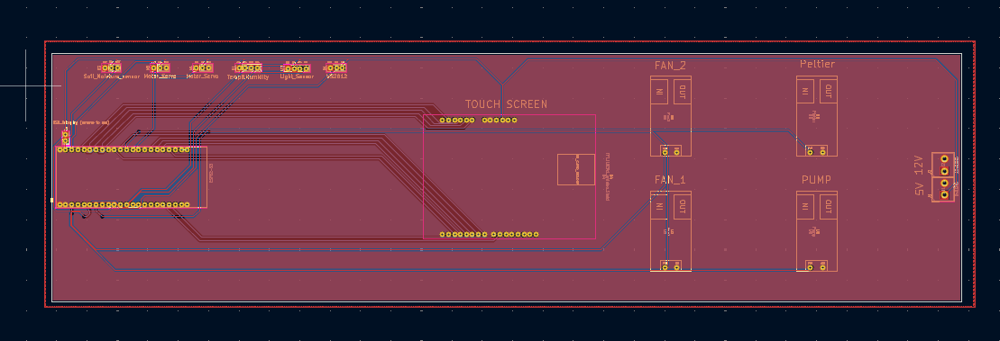
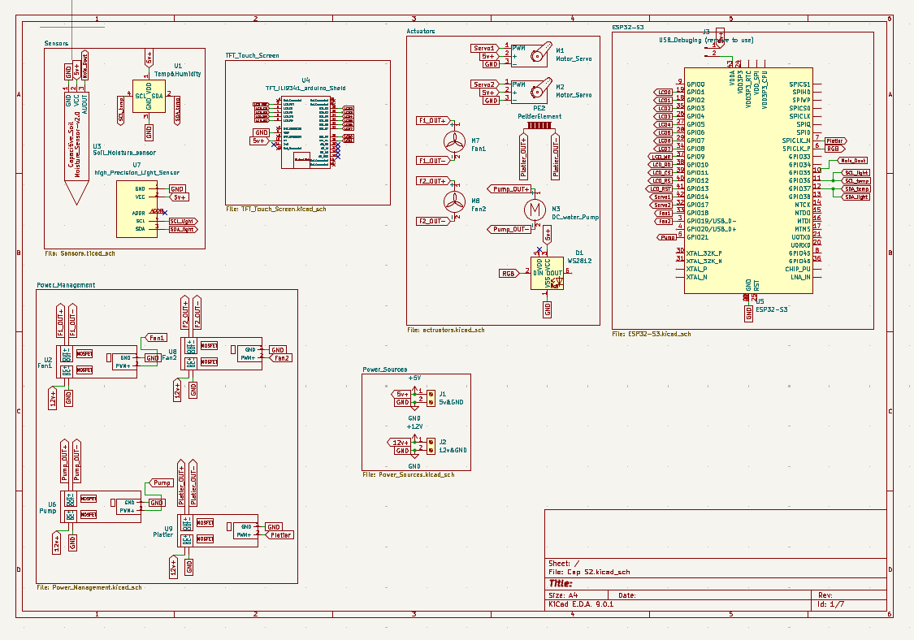
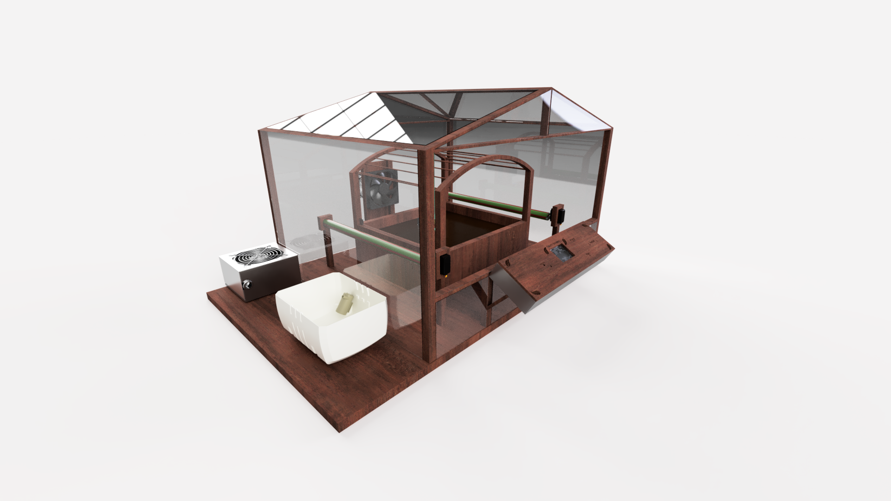
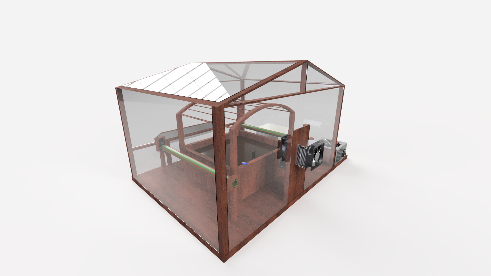
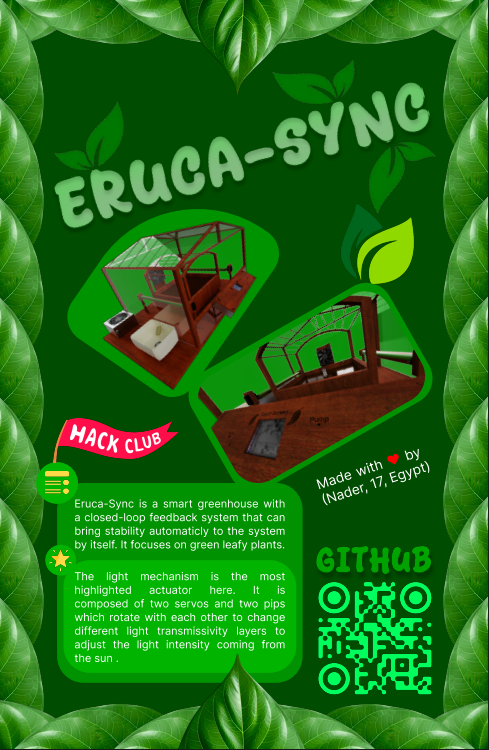

# Eruca-Sync
-------

  

--------
## Description:
A smart greenhouse with a closed-loop feedback system that can bring stability automatically to the system by itself. It focuses on green leafy plants and on three parameters.  

* Light intensity
* Soil moisture
* Temprature 

It has actuators that are responible of making the anti-changes that reverse any changes that occur in the environment, like temperature rise, soil drought, and over-light on the green leafy plants. 

### Why I am making this:
I made this because there are plants that I really want to try, but I can't plant them in my home because there is no suitable environment for them. So, the project will provide these plants with their suitable environment. For Example, around my home, I can't plant Eruca (Arugula) because of the direct sunlight and the high temperature. I really want to try planting Arugula, so I thought about how to plant it around my home, but with minimal effort. So, I got this idea to make a self-balancing environment for the Arugula or any plant species. 

### Highlight
The light mechanism is the most highlighted actuator here. It is composed of two servos and two pips, which rotate with each other to change different light transmissivity layers to increase the light intensity coming from the sun or decrease it.

## How it works:

1. First, just plug the power plug into any 220V power source. 
2. The screen will light up, asking which plant species you are planting. 
3. Choose the plant species, and that's it.
4. Leave it on its own; it will show you the real-time parameter readings as it is waiting for any changes to power up the actuators.

## Some photos of the project:

### PCB: 

### 3D PCB: 

### Schematic:

### 3D desing:

 
 
 
> [!NOTE]
> Here you are the [Onshape Docs](https://cad.onshape.com/documents/9a096ebca3b52eda8b421bd5/w/291a79fda487721e4172dde6/e/f2d4edb63e0c7f47e937ec7d)

### Fallout Zine  :
 

## How to build the Code:
1. Install PIO (PlatformIO) and clone the repo
2. Open the Eruca-Sync-Code folder which has the source code in platformIO vscode.
3. Do what ever you want, edit, add, remove, etc.
4. Just click the check mark down there in vscode to build the code into a .bin and .elf files.
5. Or just click the arrow icon while connecting the esp to the PC/Laptop to directly compile and upload the code.
6. Enjoy ;)

-----------------

# Made with ❤️ By Nadooor
